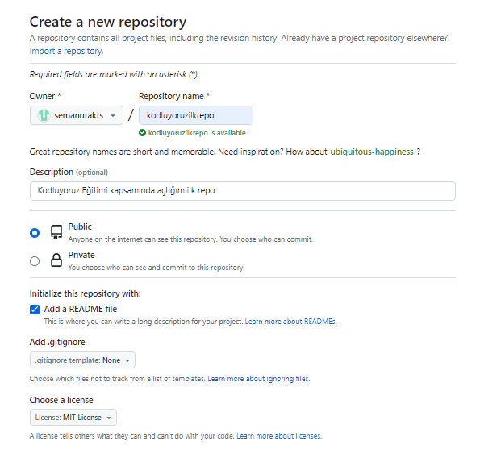

# Kodluyoruz İlk Repo

Bu repo [Kodluyoruz](https://www.kodluyoruz.org) Front-End Eğitiminde oluşturduğumuz ilk repo. İçerisinde bir adet README dosyası, bir adet de index.html barındırıyor.




## Installation

Öncelikle projeyi clonelayın. 

```bash
git clone https://github.com/semanurakts/kodluyoruzilkrepo.git
```

## Usage

Proje cloneladıktan sonra Visual Studio Code programında açınız. 

```linux
cd kodluyoruzilkrepo
code .
```

## Contributing

Pull requestler kabul edilir. Büyük değişiklikler için, lütfen önce neyi değiştirmek istediğinizi tartışmak için bir konu açınız.

## License

[MIT](MIT License)

Copyright (https://choosealicense.com/licenses/mit/)


